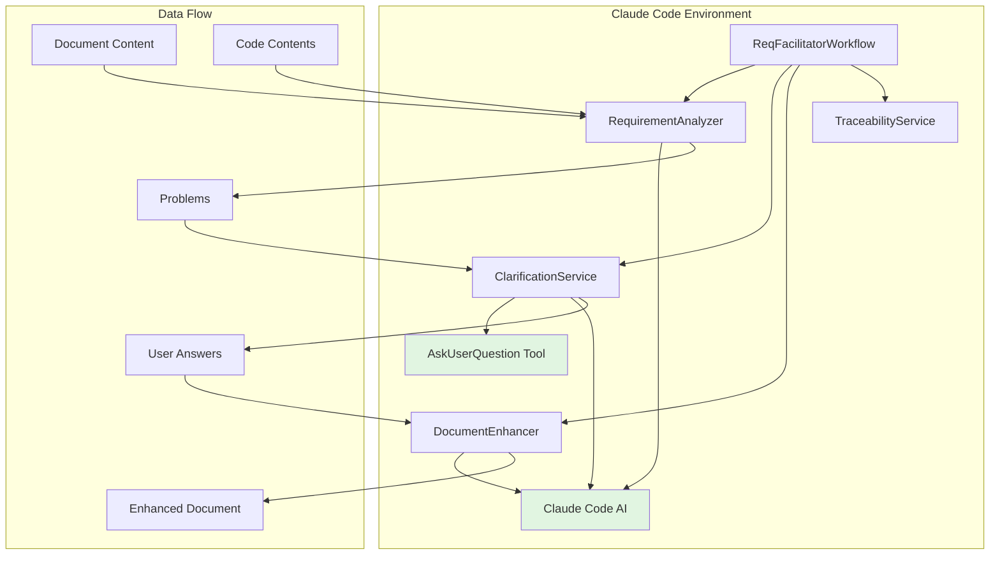
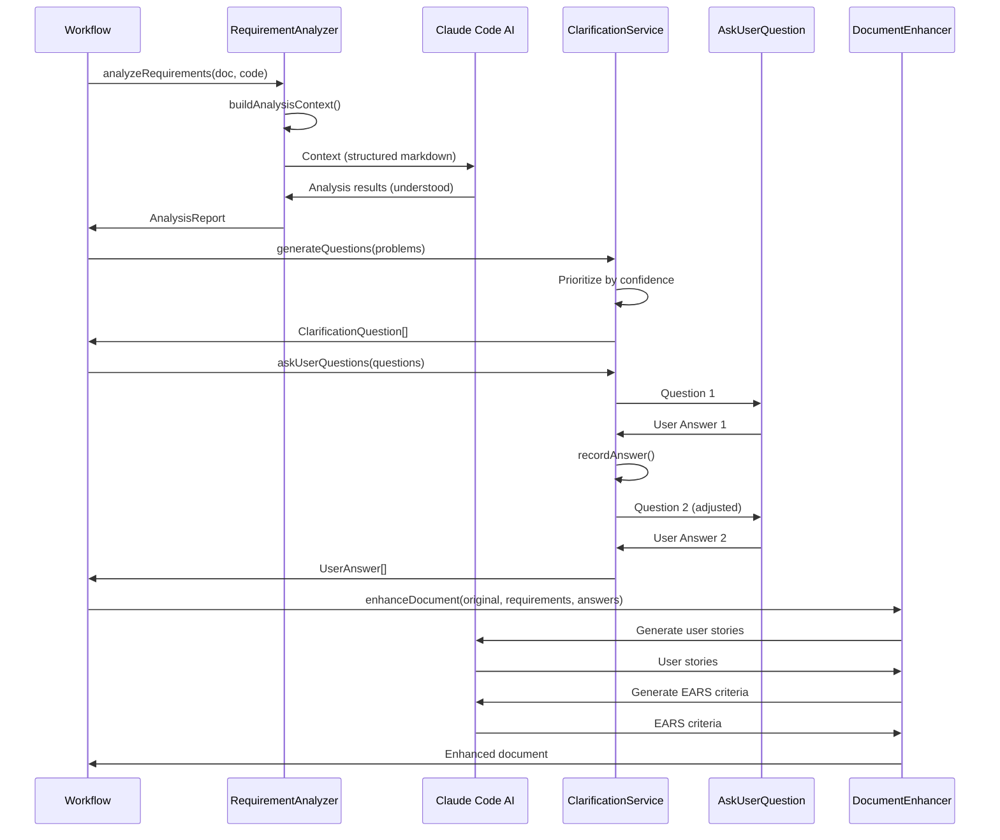

# Design: Implement Core Business Logic

> **⚠️ IMPORTANT: LEGACY DOCUMENT - PLANNING ONLY**
> **This skill package has always been configuration-driven using SKILL.md**
> **No TypeScript code was ever implemented**
> **See SKILL.md for the actual implementation**

> **Spec Name**: implement-core-business-logic
> **Created**: 2025-11-02
> **Status**: Draft (Planning Documentation - Never Implemented)
> **Based on Requirements**: REQ-1 through REQ-6

---

## Introduction

This design document specifies the technical implementation of core business logic for the HS Req Facilitator Skill. The implementation will transform placeholder methods into functional AI-driven analysis and clarification systems that integrate seamlessly with Claude Code's native capabilities.

### Design Goals

1. **AI-Driven Analysis**: Implement real requirement analysis using Claude Code's AI understanding
   - **First List Functional Requirements**: Must first list all functional requirements based on code and document understanding
   - **Then Analyze Problems**: After listing requirements, analyze missing information and unclear points
2. **Interactive Clarification**: Integrate AskUserQuestion tool for real user interaction
   - **Supplement Requirements**: Use AskUserQuestion to interactively supplement missing requirement information
3. **Document Enhancement**: Generate user stories and EARS format acceptance criteria using AI
4. **Spec-Workflow Integration**: All requirements processed in spec-workflow format, regardless of whether the project uses spec-workflow
5. **Seamless Integration**: Work within existing workflow architecture without breaking changes

### Key Constraints

- **Claude Code Skill Environment**: Code runs in Claude Code environment where AI capabilities are provided by the platform
- **No External LLM APIs**: Cannot call external AI services directly
- **No Regex Patterns**: All analysis must use AI understanding, not regex matching
- **Backward Compatibility**: Must work with existing type definitions and service interfaces

---

## Architecture Overview

### System Architecture



### Component Responsibilities

1. **RequirementAnalyzer**: Performs AI-driven analysis of documents and code
2. **ClarificationService**: Manages interactive clarification using AskUserQuestion
3. **DocumentEnhancer**: Generates user stories and EARS criteria using AI
4. **ReqFacilitatorWorkflow**: Orchestrates the complete workflow

---

## Component Design

### 1. RequirementAnalyzer Service

#### Current State
- Has placeholder `analyzeRequirements()` that returns empty arrays
- Has `buildAnalysisContext()` helper method
- Has placeholder `detectProblems()` and `extractRequirements()` methods

#### Design Changes

**1.1. Enhanced analyzeRequirements() Method**

**Purpose**: Perform actual AI-driven analysis instead of returning empty arrays

**Implementation Strategy**:
- **Step 1: First List Functional Requirements** (Required, first step)
  - Based on code and document understanding, list all functional requirements
  - Each functional requirement includes: function name, function description, function behavior, input/output, code implementation status, requirement document location
  - List non-functional requirements: performance, security, reliability, etc.
  - Classify requirements: core functional requirements (P0), important functional requirements (P1), general functional requirements (P2)
- **Step 2: Then Analyze Problems and Missing Information**
  - Based on functional understanding, identify unclear requirements, missing information, vague expressions
  - Compare code and documents, identify inconsistencies
  - Assess information completeness for each requirement (acceptance criteria, detailed description, stakeholders)
  - Determine if false positives (whether code implementation already explains this information)
  - Clearly state each problem: what is missing, why it is a problem, whether it is a false positive, how to fix
- Build comprehensive analysis context using existing `buildAnalysisContext()` method
- Structure the context to guide Claude Code AI's understanding
- Return structured AnalysisReport with actual problems, recommendations, and statistics

**Key Design Decisions**:
- **AI Integration**: Code comments and context structure guide Claude Code AI to perform analysis
- **Context Structure**: Format context as structured Markdown to help AI understand:
  - Document structure and content
  - Code implementation patterns
  - Comparison points between code and documents
- **Result Parsing**: Claude Code AI will understand the code logic and generate appropriate AnalysisReport structure

**Code Structure**:
```typescript
async analyzeRequirements(
  documentContent: string,
  codeContents: Record<string, string>
): Promise<AnalysisReport> {
  // 1. Build analysis context
  const context = this.buildAnalysisContext(documentContent, codeContents);

  // 2. Structure context for AI understanding
  // Claude Code AI will understand this context and perform analysis
  // The AI will identify:
  // - Missing information (missing-info)
  // - Uncertain statements (uncertainty)
  // - Inconsistencies between code and docs (inconsistency)

  // 3. Return structured report
  // Claude Code AI will populate this structure based on its analysis
  return {
    problems: [], // Will be populated by AI understanding
    recommendations: [], // Will be populated by AI understanding
    priorities: [], // Will be populated by AI understanding
    statistics: {
      totalProblems: 0,
      highPriorityProblems: 0,
      mediumPriorityProblems: 0,
      lowPriorityProblems: 0,
    },
  };
}
```

**AI Guidance Strategy**:
- Add detailed comments explaining what analysis should be performed
- Structure context in a way that guides AI understanding
- Use clear variable names and structure that AI can interpret

**1.2. Enhanced detectProblems() Method**

**Purpose**: Detect specific problem types using AI understanding

**Implementation**:
- Build focused context for problem detection
- Guide AI to identify three problem types:
  - `missing-info`: Required information not present
  - `uncertainty`: Vague or ambiguous statements
  - `inconsistency`: Conflicts between code and documents
- Assign confidence levels based on AI certainty

**1.3. Enhanced extractRequirements() Method**

**Purpose**: Extract requirements from document using AI understanding

**Implementation**:
- Build context focused on requirement extraction
- Guide AI to identify user stories, acceptance criteria, and business value
- Return structured Requirement[] array

---

### 2. ClarificationService Integration with AskUserQuestion

#### Current State
- Has `generateQuestions()` method that creates questions from problems
- Has conversation context management
- Missing actual AskUserQuestion integration

#### Design Changes

**2.1. AskUserQuestion Integration Pattern**

**Challenge**: Claude Code Skill code runs in AI environment - how to trigger AskUserQuestion tool?

**Solution**:
- **Code Comments Strategy**: Add detailed comments explaining when and how to use AskUserQuestion
- **Context Structure**: Structure code and data in a way that guides Claude Code AI to use AskUserQuestion
- **Explicit Guidance**: Use comments to explicitly guide AI behavior
- **Supplement Requirements**: Use AskUserQuestion to interactively supplement missing requirement information based on functional requirements list
- **Question Generation**: Generate questions based on functional requirements list and problem analysis results
- **Iterative Interaction**: Ask questions one by one, supplementing requirements until all key questions are answered

**Implementation Pattern**:
```typescript
async askUserQuestions(questions: ClarificationQuestion[]): Promise<UserAnswer[]> {
  const answers: UserAnswer[] = [];

  for (const question of questions) {
    // 在Claude Code环境中，Claude Code AI会自动理解以下逻辑：
    // 1. 需要向用户提问
    // 2. 使用AskUserQuestion工具与用户交互
    // 3. 等待用户回答
    // 4. 记录用户回答

    // 构建提问上下文
    const questionContext = {
      question: question.question,
      context: question.context,
      relatedProblem: question.relatedProblem,
      previousAnswers: answers,
    };

    // Claude Code AI应该在这里使用AskUserQuestion工具
    // 工具调用格式：
    // AskUserQuestion({
    //   question: question.question,
    //   context: questionContext
    // })

    // 等待用户回答（由Claude Code AI处理）
    // const userAnswer = await AskUserQuestion(...);

    // 记录回答
    // this.recordAnswer(question.id, userAnswer);
  }

  return answers;
}
```

**2.2. Enhanced generateQuestions() Method**

**Current Implementation**: Basic question generation from problems

**Enhancement**:
- Add AI-guided question generation
- Use AI to make questions more contextual and relevant
- Prioritize questions by problem confidence

**2.3. Enhanced adjustQuestions() Method**

**Purpose**: Generate follow-up questions based on user answers using AI

**Implementation**:
- Analyze user answers using AI understanding
- Generate contextual follow-up questions
- Maintain conversation flow

---

### 3. DocumentEnhancer AI-Driven Generation

#### Current State
- Has `enhanceDocument()` with basic structure
- Has placeholder `generateUserStory()` and `generateEARS()` methods

#### Design Changes

**3.1. Enhanced generateUserStory() Method**

**Purpose**: Generate standard user story format using AI understanding

**Implementation Strategy**:
- Build context with requirement information
- Guide AI to generate format: "As a [role], I want [feature], so that [benefit]"
- Use AI understanding to extract role, feature, and benefit from requirement

**Code Structure**:
```typescript
generateUserStory(requirement: Requirement): string {
  // 构建用户故事生成上下文
  // Claude Code AI将理解以下信息并生成标准格式的用户故事：
  // - 需求标题和描述
  // - 用户澄清的回答
  // - 代码实现情况

  // 用户故事格式：As a [role], I want [feature], so that [benefit]
  // Claude Code AI应该根据需求信息生成符合此格式的用户故事

  // 返回AI生成的用户故事
  return requirement.userStory || `作为用户，我希望${requirement.title}，以便实现业务目标。`;
}
```

**3.2. Enhanced generateEARS() Method**

**Purpose**: Generate EARS format acceptance criteria using AI understanding

**Implementation Strategy**:
- Build context with requirement details
- Guide AI to generate format: "WHEN [condition] THEN [system] SHALL [response]"
- Use AI understanding to identify conditions, system behavior, and expected responses

**3.3. Enhanced enhanceDocument() Method**

**Current Implementation**: Basic structure with placeholder content

**Enhancement**:
- Use `generateUserStory()` and `generateEARS()` for actual generation
- Integrate user answers into enhancement process
- Maintain original document content (append mode)
- **Spec-Workflow Format**: Generate requirements document in spec-workflow format regardless of whether the project uses spec-workflow
- **Integration Handling**:
  - If project uses spec-workflow: Update `.spec-workflow/specs/*/requirements.md`
  - If project doesn't use spec-workflow: Generate spec-workflow format document and ask user if they want to create spec-workflow structure

---

### 4. Workflow Integration

#### Current State
- `execute()` method starts workflow
- `stage2AnalyzeRequirements()` calls analyzer but gets empty results
- `stage3InteractiveClarification()` has placeholder
- `stage4EnhanceRequirements()` has placeholder

#### Design Changes

**4.1. Enhanced stage2AnalyzeRequirements()**

**Current**: Calls analyzer but receives empty arrays

**Enhancement**:
- After calling `analyzeRequirements()`, verify results are not empty
- Handle cases where analysis returns actual problems
- Pass results to next stage

**4.2. Enhanced stage3InteractiveClarification()**

**Current**: Placeholder method

**Implementation**:
- Get analysis results from stage 2
- Generate questions using `ClarificationService.generateQuestions()`
- Use AskUserQuestion integration pattern to interact with users
- Collect and record user answers
- Adjust questions based on answers

**4.3. Enhanced stage4EnhanceRequirements()**

**Current**: Placeholder method

**Implementation**:
- Get user answers from stage 3
- Get functional requirements list from stage 2
- Extract requirements from original document and answers
- Generate user stories and EARS criteria
- Enhance document using `DocumentEnhancer.enhanceDocument()`
- **Spec-Workflow Integration**:
  - Detect if project uses spec-workflow (check `.spec-workflow` directory)
  - If project uses spec-workflow: Update `.spec-workflow/specs/*/requirements.md` using spec-workflow MCP tools
  - If project doesn't use spec-workflow: Generate spec-workflow format document and ask user if they want to create spec-workflow structure (via AskUserQuestion)
- Save enhanced document

---

## Data Flow Design

### Analysis Flow



---

## Implementation Strategy

### Phase 1: RequirementAnalyzer Implementation

**Tasks**:
1. Enhance `analyzeRequirements()` to guide AI analysis
2. Implement `detectProblems()` with AI-guided detection
3. Implement `extractRequirements()` with AI-guided extraction
4. Add context structuring helpers

**Key Files**:
- `src/services/requirementAnalyzer.ts`

### Phase 2: ClarificationService Integration

**Tasks**:
1. Add AskUserQuestion integration pattern
2. Implement `askUserQuestions()` method
3. Enhance `adjustQuestions()` with AI guidance
4. Improve question generation logic

**Key Files**:
- `src/services/clarificationService.ts`

### Phase 3: DocumentEnhancer Implementation

**Tasks**:
1. Implement `generateUserStory()` with AI guidance
2. Implement `generateEARS()` with AI guidance
3. Enhance `enhanceDocument()` integration

**Key Files**:
- `src/services/documentEnhancer.ts`

### Phase 4: Workflow Integration

**Tasks**:
1. Enhance `stage2AnalyzeRequirements()` to handle real results
2. Implement `stage3InteractiveClarification()` with AskUserQuestion
3. Implement `stage4EnhanceRequirements()` with full flow

**Key Files**:
- `src/index.ts`

---

## Technical Decisions

### Decision 1: AI Integration Approach

**Option A**: Explicit AI API calls (not possible - Claude Code Skill constraint)
**Option B**: Code comments and context structure to guide AI (selected)

**Rationale**:
- Claude Code Skill runs in AI environment
- AI understands code logic automatically
- Comments and structure guide AI behavior
- No external API calls needed

### Decision 2: AskUserQuestion Integration

**Option A**: Direct tool import (not available in code context)
**Option B**: Code comments guiding AI to use tool (selected)

**Rationale**:
- Claude Code AI understands when to use AskUserQuestion
- Comments explicitly guide when and how to use tool
- Follows Claude Code Skill pattern

### Decision 3: Result Handling

**Option A**: Return empty arrays, let AI populate later (current)
**Option B**: Structure code to guide AI to populate results (selected)

**Rationale**:
- Code structure guides AI understanding
- Comments explain expected results
- AI understands code logic and populates accordingly

---

## Error Handling

### AI Service Unavailability

**Scenario**: Claude Code AI understanding fails

**Handling**:
- Provide friendly error messages
- Suggest retry
- Log error for debugging

**Implementation**:
```typescript
try {
  const report = await this.analyzeRequirements(doc, code);
  if (report.problems.length === 0 && /* other checks */) {
    throw new Error('AI分析未返回结果，请重试');
  }
} catch (error) {
  console.error('❌ 需求分析失败:', error);
  console.log('💡 建议：请检查文档格式或重试');
}
```

### File Operation Failures

**Scenario**: Cannot read document or code files

**Handling**:
- Skip failed files
- Continue processing others
- Log warnings

---

## Testing Strategy

### Unit Testing

**Focus Areas**:
- Context building logic
- Question generation logic
- Document enhancement structure

**Limitations**:
- Cannot test AI understanding directly
- Cannot test AskUserQuestion integration in unit tests

### Integration Testing

**Focus Areas**:
- End-to-end workflow execution
- Service integration
- Data flow between stages

**Test Scenarios**:
1. Complete workflow with sample document
2. Question generation and answer collection
3. Document enhancement output format

---

## Success Criteria

This design is successful when:

1. ✅ `RequirementAnalyzer.analyzeRequirements()` returns actual analysis results
2. ✅ `ClarificationService` integrates with AskUserQuestion tool
3. ✅ `DocumentEnhancer` generates proper user stories and EARS criteria
4. ✅ All workflow stages execute successfully with real data flow
5. ✅ Code demonstrates AI-driven logic without regex patterns

---

## Dependencies

### Existing Code
- ✅ Type definitions in `src/types/index.ts`
- ✅ Service interfaces (RequirementAnalyzer, ClarificationService, DocumentEnhancer)
- ✅ ConfigManager for configuration
- ✅ Workflow orchestration in `src/index.ts`

### External Dependencies
- ✅ Claude Code platform (AI capabilities)
- ✅ AskUserQuestion tool (provided by Claude Code)
- ✅ Node.js file system APIs

---

## Open Questions

1. **Q**: How exactly does Claude Code AI understand code comments?
   **A**: Through detailed, structured comments explaining expected behavior

2. **Q**: Can we test AskUserQuestion integration?
   **A**: Limited - relies on Claude Code AI understanding and tool availability

3. **Q**: How to handle AI understanding variations?
   **A**: Structure code and context clearly, add validation for results

---

*Design Document Version: 1.2*
*Last Updated: 2025-11-02*
*Changes:
  - Added "First List Functional Requirements" step (Step 1.1)
  - Enhanced AskUserQuestion integration to supplement requirements based on functional requirements list
  - Added spec-workflow integration regardless of project usage
  - Updated workflow stages to reflect complete implementation*
